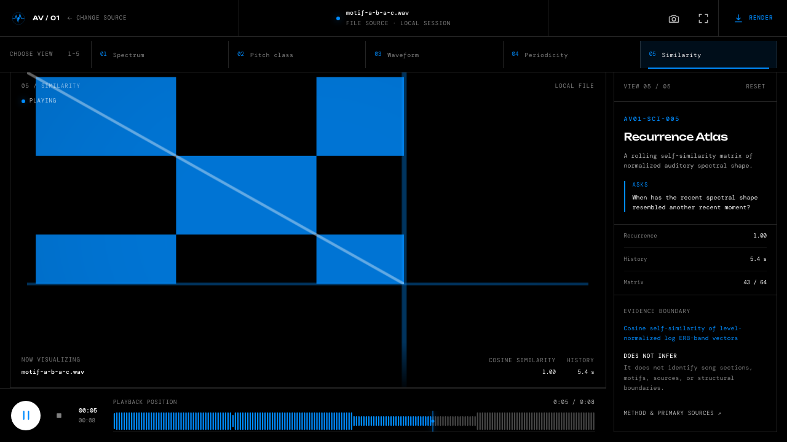
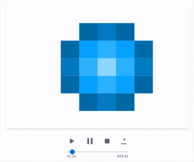

# AV/01 — Audio Visualizer

> Five views. One signal.

I started this project with one simple idea: choose a track, let the sound move a field of pixels, and record the result.

The first version was one page, one canvas and a small green grid. It was simple, imperfect and immediately alive. That version still matters to me because it proved the idea.

AV/01 is what happened when I stopped treating that idea like an effect and started treating it like an instrument.

It turns short-time spectrum, octave-folded pitch-class energy, waveform dynamics, onset-envelope periodicity and recent spectral recurrence into five visual systems that can be played, shaped, captured and recorded in real time. Those terms are deliberate: AV/01 does not pretend to identify notes, chords, beats, tempo or song sections when the evidence does not support it.

This pass gives that instrument one optical language: black for silence and the stage, electric blue for signal-derived evidence, and white for references and annotation. There are no alternate colour skins and no rainbow shortcuts. If a value changes, geometry, extent, opacity or line form has to explain why.



## Where it started

The original Audio Visualizer had one scene and one beautifully direct idea: let sound push a ripple through a field of pixels.



I am keeping that first version visible. It is not something I want to erase underneath the rebuild—it is the reason the rebuild exists.

- [`origin-green-grid`](https://github.com/sergiopesch/my-audio-visualizer/tree/origin-green-grid) marks the literal first working green-grid version from January 2025.
- [`v0.1.0-original`](https://github.com/sergiopesch/my-audio-visualizer/tree/v0.1.0-original) preserves the finished original release.
- [`av01-launch`](https://github.com/sergiopesch/my-audio-visualizer/tree/av01-launch) marks the first complete AV/01 rebuild now living on `main`.
- [The archived V1 README](docs/history/AUDIO-VISUALIZER-V1.md) preserves the original README text, with only an archival note and its demo-image path adjusted.
- [From Audio Visualizer to AV/01](docs/PRODUCT-REVIEW.md) explains what changed, what I learned from ThorstenClip and why I rebuilt the system this way.
- [The scientific contract and provenance](docs/SCIENCE.md) states exactly what each scene computes, what informs it and what it cannot claim.
- [The release-candidate validation record](docs/VALIDATION.md) publishes the fixtures, measured controls, failures and remaining open gates.
- [The research roadmap](docs/RESEARCH-ROADMAP.md) separates the improvements I can defend now from the experiments that still need new analysis and validation.

Along the way, I built ThorstenClip to find out how much further this idea could go. It taught me a lot about stage-first design, deeper audio analysis, visual composition and making the final result feel authored instead of decorative.

I brought the strongest lessons back here without bringing the Thorsten name, look or personality with them. AV/01 has its own identity.

## What AV/01 is now

AV/01 is a browser-native visual instrument for music, voice, instruments and live system audio.

- Open local audio by picker or drag and drop.
- Capture audio from a shared tab or application.
- Use a microphone for a room, voice or instrument.
- Open five built-in PCM reference signals that isolate the behavior of each view.
- Read the signal through 24 ERB-rate-spaced triangular bands, twelve octave-folded pitch classes, time-domain dynamics, onset-envelope periodicity and rolling spectral self-similarity.
- Shape five real-time scenes with sensitivity, intensity, glow, detail, frame and visual-comfort controls inside one fixed optical system.
- Save still frames or record a complete visual performance with audio.
- Keep the entire process local to the browser.

Your audio stays with you. There is no upload service, account or tracking layer. The browser does the listening, drawing, snapshotting and recording.

## Five visual systems

| Key | Scene and claim | What is represented | What it does not claim |
| --- | --- | --- | --- |
| `1` | **Auditory Field** · `AV01-SCI-001` | Blackman-windowed short-time spectrum grouped into 24 ERB-spaced bands | Source or instrument recognition, masking or an individualized hearing model |
| `2` | **Tonal Orbit** · `AV01-SCI-002` | Twelve-bin, octave-folded equal-tempered pitch-class energy | Note, octave, chord, key or tuning identification |
| `3` | **Temporal Scope** · `AV01-SCI-003` | Peak-preserving min/max reduction of the recent mono waveform, plus RMS, sample peak, crest factor and zero-crossing rate | SPL, LUFS, true peak, stereo phase or calibrated measurement |
| `4` | **Rhythm Lattice** · `AV01-SCI-004` | Spectral-change onset strength and short-term autocorrelation periodicity | A confirmed beat, tempo, downbeat, meter or groove |
| `5` | **Recurrence Atlas** · `AV01-SCI-005` | Rolling cosine self-similarity of normalized log-ERB spectral shape | Song sections, motifs, sources or structural boundaries |

Every scene can use three output frames. Sensitivity, intensity, glow and detail alter presentation without changing the analysis underneath. The formulas, timing windows, pixel mappings, sources and limitations behind every claim ID live in the [scientific contract](docs/SCIENCE.md).

## Controlled reference signals

The landing page includes five short mono PCM16 WAVs generated on demand at 48 kHz. They are not stock music and they do not travel over the network. Each one opens through the same file-decoding, analyser, feature-bus and renderer path as a user track, automatically selects the relevant view and states what to listen for, what to watch and which property is controlled.

| View | Built-in signal | Expected demonstration |
| --- | --- | --- |
| Spectrum | Equal-amplitude 375 Hz / 6 kHz alternation | ERB-band position, centroid and rolloff move while segment RMS remains approximately equal |
| Pitch class | A3 / A4 octave pair | The octave and waveform period change while the strongest folded pitch class remains A |
| Waveform | Sine / triangle / softly clipped sine | Frequency and peak remain fixed while time-domain shape and crest factor change |
| Periodicity | Fifteen transients at 0.5 s spacing | After sufficient history, the onset-envelope candidate approaches 120 BPM-equivalent |
| Similarity | A–B–A–C spectral-shape sequence | The quieter second A still creates off-diagonal recurrence because shape vectors are level-normalized |

The WAV headers, deterministic SHA-256 hashes and the expected invariants above are executable tests. This is a public demonstration layer for established signal-analysis methods and AV/01's internally tested implementation—not peer review, perceptual proof or calibrated measurement.

## The differentiator: representation, not skin

AV/01 is not five cosmetic treatments of one FFT. Each scene owns a separate declared feature channel and transform. Automated contract tests enforce the routing declarations and scan every WebGL scene for cross-scene feature access; optimized-browser signal gates exercise the real Canvas 2D fallback against the same map, keeping fixed-duration evidence histories separate from software-GPU throughput. That proves implementation separation, not statistical independence or scientific validity. Matched controls then change one signal property at a time:

| Controlled comparison | Representation expected to change | Evidence expected to remain stable |
| --- | --- | --- |
| Equal-RMS 375 Hz versus 6 kHz tones | Auditory Field spectral position | Temporal RMS level |
| A3 versus A4 | Auditory Field position and waveform period | Tonal Orbit's strongest pitch class |
| A waveform versus its polarity inverse | Temporal Scope waveform sign | Magnitude spectrum, level and crest factor |
| Periodic versus jittered transient trains with the same event count | Rhythm Lattice periodicity evidence | The existence and count of source events |
| A–B–A versus A–B–C spectral-shape sequences | Recurrence Atlas off-diagonal similarity | The declared per-frame spectral-shape vocabulary |

That is the scientifically defensible differentiator: five falsifiably different representations, visible methods and explicit limits. The controls demonstrate implementation separation; they do not prove that AV/01 is perceptually superior, peer reviewed or a calibrated measurement instrument.

## One optical language

The current brand is intentionally narrow:

| Source pigment | Role |
| --- | --- |
| `#000000` | Silence, absence and the stage |
| `#008CFF` | Signal-derived evidence, live state and interaction |
| `#FFFFFF` | Reference geometry, thresholds, labels and structure |

All darker, quieter or softer tones are opacity blends of those three source pigments. Electric blue never stands in for a scientific variable by itself, and colour is never the only cue for selection, recording, error or focus. This follows current guidance on colour integrity and accessible non-text contrast while keeping AV/01 unmistakably its own instrument.

On white surfaces, small text remains black because electric blue is a large-type and non-text accent there; on black surfaces, blue has sufficient normal-text contrast. White reference axes are rendered at a fixed 38% intensity after presentation tone mapping, so sensitivity, intensity and glow cannot erase the geometry needed to read a scene.

## It listens to more than volume

The original visualizer reduced each frame of audio to one peak value. AV/01 keeps the immediacy but gives the sound a larger, more exact vocabulary:

- 24 triangular bands laid out on the ERB-rate scale.
- Twelve octave-folded pitch-class energy bins under a fixed A4 = 440 Hz, twelve-tone equal-tempered mapping.
- A peak-preserving reduction of the recent mono waveform with RMS, sample peak, crest factor and zero-crossing rate.
- Positive log-spectral change for onset strength, followed by a short-window periodicity candidate.
- An eight-second rolling self-similarity matrix of normalized log-ERB spectral shape.
- Spectral centroid, 85% rolloff and a high-frequency power ratio as acoustic descriptors—not direct measures of perceived brightness.
- Silence hysteresis so the visuals settle instead of chattering around a threshold.

The level display is normalized digital dBFS, not LUFS or acoustic SPL. Concentration, onset, periodicity support and cosine similarity are shown as unitless indices rather than percentages that could look like probabilities. The analyser is a browser-defined mono downmix, microphone processing can vary by device and browser, and the nominal 50 Hz feature clock can jitter. The goal is not to show more data. It is to make the visuals respond in ways that feel musical while staying honest about what was measured.

## Start the instrument

### Requirements

- Node.js `24` or newer (`.nvmrc` selects the CI baseline)
- npm `11`
- A current desktop browser; source capture and recording support are capability-dependent

### Install and run

```bash
git clone https://github.com/sergiopesch/my-audio-visualizer.git
cd my-audio-visualizer
npm ci
npm run dev
```

Open [http://localhost:3000](http://localhost:3000).

No local certificate is required. `localhost` is accepted as a trustworthy development origin by the browser. Use HTTPS when the app is served from a hostname, LAN address, preview deployment or production domain.

For a production build:

```bash
npm run build
npm run start
```

## Using AV/01

1. Choose a controlled reference signal, **Open audio**, **System** or **Mic**.
2. When capturing system audio, select a tab or application and enable the browser's **Share audio** option.
3. Choose a view and open the optional appearance, frame or provenance panels when needed.
4. Scrub a file with the waveform timeline or perform against a live source.
5. Save a PNG frame, enter fullscreen or open **Render** to record the performance.

Before a source is active, AV/01 can show a deterministic **synthetic preview** generated at a nominal 48 kHz with seed 7 and a 118 BPM pulse pattern. It is a designed feature demonstration, not captured audio, and it is never used to fill in missing live signal.

### Keyboard controls

| Key | Action |
| --- | --- |
| `Space` | Play or pause the landing demo/audio source |
| `1`–`5` | Switch visual scene |
| `F` | Enter or leave stage fullscreen |
| `S` | Download the current frame as PNG |
| `E` | Open the render panel |

Shortcuts are ignored while a form control is focused or the render dialog is open.

## Rendering a performance

AV/01 records in real time at 30 FPS. The canvas and the recordable audio destination are joined inside the browser, so the recording uses the same signal, scene, fixed optical system, settings and playback clock as the live stage.

| Frame | Dimensions | File source | Live source |
| --- | ---: | --- | --- |
| Landscape | 1280 × 720 | Starts at `00:00`; ends with the track or first safety limit | Stops when requested or at the first safety limit |
| Square | 1080 × 1080 | Starts at `00:00`; ends with the track or first safety limit | Stops when requested or at the first safety limit |
| Portrait | 720 × 1280 | Starts at `00:00`; ends with the track or first safety limit | Stops when requested or at the first safety limit |

The browser negotiates the recording format. WebM with VP9/VP8 and Opus is preferred; MP4/H.264/AAC is attempted where the browser exposes it. The downloaded extension always follows the actual recorder output.

Important boundaries:

- A three-minute track takes roughly three minutes to render. This is real-time capture.
- File and live renders stop at 10 minutes.
- Encoded output stops at 256 MB to protect the browser tab from exhausting memory.
- When the AV/01 tab is backgrounded during a render, recording and file playback pause together and resume when the tab becomes visible again.
- System-audio capture and available recording formats vary by browser and operating system.

## Under the hood

```text
file / system share / microphone
              │
              ▼
       Web Audio graph ──────────────► recordable audio destination
              │
              ▼
    4096-point AnalyserNode
              │
              ▼
   allocation-stable feature bus
   ERB · chroma · dynamics · onset-envelope periodicity · self-similarity
              │
              ▼
   WebGL 2 scene renderer ───────────► Canvas 2D fallback
              │
              ├──────────────────────► PNG snapshot
              └──── canvas stream + audio ──► MediaRecorder
```

The render loop is ref-driven and does not push React state on every frame. Feature arrays are allocated once and reused. Canvas dimensions are cached between resizes, test telemetry is published at a bounded cadence, and the recurrence texture is uploaded only while that scene is active and its matrix has changed. The media playhead coordinates transport and full-track export, while analysis history resets across seek, source change, stop and replay-from-end. No scene consumes an autonomous presentation clock; the feature clock remains subject to the browser-timing limits in the [scientific contract](docs/SCIENCE.md#timing-and-repeatability).

| Path | Responsibility |
| --- | --- |
| `src/hooks/useAudioEngine.ts` | Audio context, file decoding, waveform peaks, live capture, transport and recording output. |
| `src/lib/audio/feature-bus.ts` | Browser analyser ingestion, feature-frame lifecycle, smoothing, silence state and analysis routing. |
| `src/lib/audio/scientific-analysis.ts` | ERB transforms, chroma folding, onset-envelope periodicity and rolling self-similarity. |
| `src/lib/visualizer/shaders.ts` | Full-screen WebGL shader programs for the five scenes. |
| `src/lib/visualizer/renderer.ts` | Feature-to-uniform mapping, WebGL lifecycle and Canvas 2D fallback. |
| `src/hooks/useCanvasRecorder.ts` | Format negotiation, capture composition, progress, limits and downloadable recordings. |
| `src/components/studio/` | Source picker, stage, scene rail, inspector, transport, waveform and export interface. |

## Accessibility and visual comfort

- The landing animation can always be paused from the canvas or with `Space`.
- A reduced-motion preference opens the landing experience as a static frame.
- Increased-contrast and reduced-transparency preferences strengthen or simplify the interface.
- **Visual comfort** is enabled by default and reduces renderer glow and bright-highlight contrast.
- Measured frames are contained rather than cropped, including on narrow screens.
- Scene and frame radiogroups support arrow keys, `Home` and `End`; global shortcuts never steal native control activation.
- Scene, frame, transport, timeline and switch controls expose semantic names and states.
- Focus indicators, dialog semantics and error announcements are built into the interface.

Visual comfort is a comfort aid, not a certified photosensitivity safeguard.

## Browser support

Browser support is based on capabilities rather than a version number:

| Capability | Browser API | Notes |
| --- | --- | --- |
| Audio-file visualization | Web Audio API | Exact MP3, AAC/M4A, FLAC, OGG, Opus, WAV and WebM decoding support varies. |
| Microphone input | `getUserMedia()` | Requires permission and a secure context. |
| System/tab audio | `getDisplayMedia()` with audio | Availability depends on the browser, OS and selected share target. |
| Primary renderer | WebGL 2 | Canvas 2D is used when WebGL 2 cannot be created. |
| Video export | `captureStream()` and `MediaRecorder` | MIME types and codecs are browser-specific. |
| Fullscreen stage | Fullscreen API | Some mobile browsers limit element fullscreen behavior. |

## Development checks

Run the complete local release gate—including lint, types, deterministic tests and fixtures, dependency audit, production build and Chromium journeys—with one command:

```bash
npm run release:check
```

After a fresh dependency install, install the test browser once with `npm run browsers:install` before running that gate.

The same checks remain available individually for focused development:

```bash
npm run type-check
npm run lint -- --max-warnings=0
npm test
npm run science:fixtures:check
npm run audit:ci
npm run build
npm run test:e2e
```

GitHub Actions runs the granular checks on pull requests and pushes to `main`. Failed browser runs retain their Playwright screenshot, video and trace evidence for seven days.

To rebuild the measured README image, run the app at `http://127.0.0.1:3000` and then run `npm run docs:screenshot`. Set `AV01_CAPTURE_URL` when the app is running somewhere else. The capture script opens the deterministic A–B–A–C fixture, waits for a populated Recurrence Atlas and rejects browser console errors.

The first AV/01 rebuild was exercised in a real browser across desktop, mobile and short-landscape layouts; WebGL context loss; Canvas 2D fallback; reduced motion; file playback; background-tab recording; and a complete 1280 × 720 VP9/Opus video export. That remains the historical UI/export baseline. The scientific-analysis candidate now has a separate [validation record](docs/VALIDATION.md): deterministic, scene-routing, matched-signal, reset and local-file export gates pass; live-capture integration is partial and the defined long-session gate is still open. These are internal engineering results, not peer review, perceptual validation or metrological approval.

## What comes next

This version has a clear technical boundary: `AnalyserNode`, WebGL 2 with Canvas fallback and real-time `MediaRecorder` output.

The next step I care about most is a public **Experiment / Compare** view: the existing matched fixtures side by side, with the expected change, expected invariant and observed values visible instead of hidden in a test log. After that comes sample-clocked AudioWorklet capture with a fixed-hop STFT and worker/WASM analysis, tuning-aware pitch-class energy, multiple periodicity hypotheses, multiscale recurrence, recorded cross-browser signal fixtures and independent method review.

The strongest candidate for a genuinely new sixth representation is a spectrotemporal modulation field: temporal modulation rate against spectral modulation scale. That would ask a new question—how energy fluctuates across temporal rate and spectral scale—rather than repainting one of the five questions AV/01 already answers. It belongs on the roadmap until its transform, controls and limitations are validated end to end.

The goal is not more particles, more controls or louder effects. I want AV/01 to become the most expressive browser-native audio visualizer I can build: musically aware, visually distinctive, technically honest and open enough for someone else to make the result their own.

AV/01 is a major step toward that standard. It is not the end of the story.
